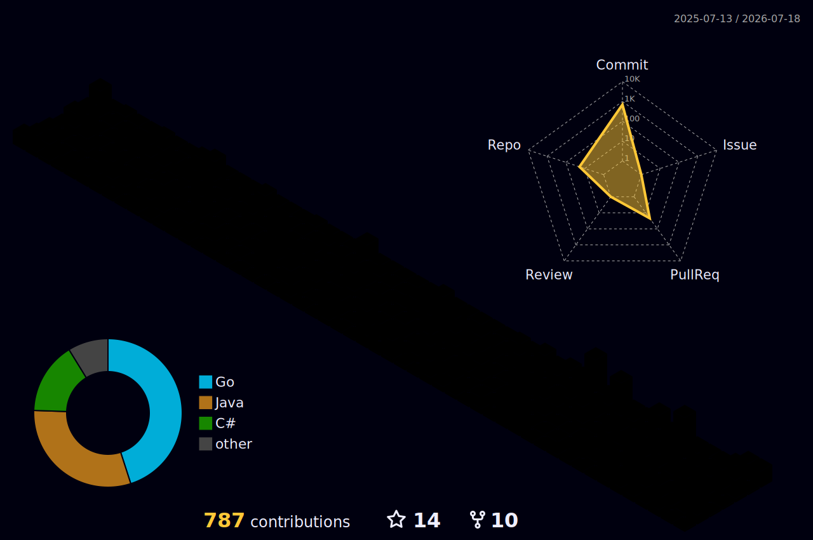

<div align="center">

# Hi, I'm Ariel Piñeiro 👋

### Head of Engineering · Senior IT Expert · 20+ years in tech 🐹


*Software Enthusiast · Programming Educator · Senior & Executive Manager — based in **Barcelona, Spain**.*

*I build and lead engineering organizations that ship **scalable, maintainable and high-performance backend platforms**, aligning technology with real business outcomes.*

<p>
  <a href="https://www.linkedin.com/in/arielpineiro/" target="_blank" rel="nofollow noopener noreferrer">
    
  </a>
  <a href="mailto:arielsrv@gmail.com">
    
  </a>
  <a href="https://about.me/arielpineiro/" target="_blank" rel="noopener noreferrer">
    
  </a>
  <a href="https://github.com/arielsrv?tab=repositories" target="_blank" rel="noopener noreferrer">
    
  </a>
</p>

<p>
  
  
  
  
  
  
</p>

</div>

---

## 🚀 About me

Experienced technology professional with **20+ years** of expertise in **IT leadership, hands-on technical leadership and backend development**. Dedicated to creating **scalable, maintainable code aligned with business needs** while enhancing user experience in close collaboration with product teams.

- 🧠 From **Developer → Architect → Tech Lead → CTO → Head of Engineering**.
- 🐹 **Go expert** (~60% of my repos) — polyglot in **Java, C#, Python, Kotlin, Groovy**.
- 🏛️ Architecture end-to-end: **microservices, event-driven systems, REST/gRPC, SQL & NoSQL, caching, performance, observability**.
- ☁️ Full **Docker · Kubernetes · CI/CD · Cloud** lifecycle in production.
- 👥 People & Tech Leadership: hire, mentor and scale engineering teams, define standards and career paths.
- 🤖 Currently leading **agentic / AI-based automation** initiatives for Operations at Remitee.
- 🌍 Based in **Barcelona, Catalonia · Spain** · open to **remote opportunities worldwide**.
- 🗣️ Spanish (native) · English (professional working).

> **Open to:** Head of Engineering · VP Engineering · Director · Principal / Staff · Engineering Manager — especially on Go-heavy platforms at scale.

---

## 💼 Career highlights

**🏦 Remitee — Head of Money Transfer** · *Dec 2025 → Present*
Own the Money Transfer domain & Integrations, leading Managers and Tech Leads in close collaboration with Platform Teams. Driving the **reengineering of the Money Transfer system** (scalability, maintainability, reliability) and leading **agentic / AI projects for Operations** (automation, orchestration, efficiency). Reports to the CTO.

**🐾 Grupo IskayPet (Tiendanimal · Kiwoko · Kivet · Clinicanimal) — Senior Technical Lead / Head of Backend** · *May 2022 → Dec 2025*
Head of Backend for the Digital Hub. Designed **cross-cutting reusable modules**, observability & telemetry stack, infrastructure components (auth, caching, messaging), DevOps (CI/CD, IaC, containers) and developer tooling. Drove product design with **lightweight, intuitive services**. Reported to the Engineering Director.

**🛒 Mercado Libre — Sr. IT Expert / Product Development Manager / Project Lead** · *Mar 2016 → Nov 2021 (5y 9m)*
Worked on **Mercado Shops, Mercado Puntos (Loyalty), Recommendations** and **Deals (Hot Sales, Early Access)**. As manager of *MyAccount & Messaging*, led teams of **up to 60 people with 6 direct reports**. Stack: Java, Kotlin, Go, Angular, Grails/Groovy, Spark, Python, Elasticsearch, MySQL, K/V stores, message systems, Nginx.

**🚗 DE AUTOS SA — CTO / Development Manager / Technical Leader** · *2012 → 2016*
Owned the technology strategy of a classifieds platform. Delivered a public **RESTful API with OAuth2**, scaled team **+400%**, reduced incidents **from 50 → 5/month**, achieved **0.005% error rate (NewRelic)**, **~20 ms avg response time** and **80% automation coverage**.

**🌐 Globant — Technical Leader / Architect** · *2010 → 2012*
Architect and tech lead for accounts such as **Deloitte, YPF, Coca-Cola and Kimberly Clark**. Roadmap, customer communication and internal tech training.

**🎓 EducacionIT — Instructor** · *2011 → 2022 (10+ years)*
Taught **Microservices, Messaging, TDD, Design Patterns & SOLID, Scrum/Agile, C#, Java, Functional Programming (LINQ / Java 8+)**.

**🎓 Universidad CAECE — Teacher** · *2016 → 2017*
Lecturer in *Algorithms and Data Structures II*; TA in *Algorithms and Data Structures I*.

*Earlier roles:* **Ternium**, **InvertirOnline.com**, **Papel Prensa S.A.** — Sr/SSr/Jr .NET Developer (2005 → 2010).

---

## 🏆 Awards & Certifications

- 🏅 **Microsoft MVP** — recognition for community contribution and technical expertise.
- 📜 **Scrum Master Certified (SMC)**.
- 🎓 **Licenciado en Sistemas** — Universidad CAECE (2005–2012).
- 🎓 **Software Architectures** — Universidad Tecnológica Nacional (UTN).

---

## 🛠 Tech Stack

<div align="center">

**Languages**


**Backend, APIs & Messaging**


**Data**


**Cloud, DevOps & Observability**


**Leadership & Methodologies**


</div>

---

## 📌 Featured Projects

<div align="center">

[](https://github.com/arielsrv/ikuiku)
[](https://github.com/arielsrv/pets-api)
[](https://github.com/arielsrv/golang-toolkit)

</div>

> 👉 Explore all my Go projects: **[github.com/arielsrv?tab=repositories&language=go](https://github.com/arielsrv?tab=repositories&language=go)**

---

## 📊 GitHub in numbers

<div align="center">

<picture>
  <source srcset="https://github-readme-streak-stats.herokuapp.com/?user=arielsrv&theme=tokyonight&hide_border=true" media="(prefers-color-scheme: dark)" />
  <source srcset="https://github-readme-streak-stats.herokuapp.com/?user=arielsrv&theme=default&hide_border=true" media="(prefers-color-scheme: light), (prefers-color-scheme: no-preference)" />
  
</picture>


<br/><br/>



</div>

---

## 🐍 Contribution Snake

<div align="center">

<picture>
  <source media="(prefers-color-scheme: dark)" srcset="https://raw.githubusercontent.com/arielsrv/arielsrv/output/github-contribution-grid-snake-dark.svg">
  <source media="(prefers-color-scheme: light)" srcset="https://raw.githubusercontent.com/arielsrv/arielsrv/output/github-contribution-grid-snake.svg">
  
</picture>

</div>

---

## 🧊 3D Contribution Graph

<div align="center">



</div>

---

## ⏱ WakaTime Activity

<!--START_SECTION:waka-->


**🐱 My GitHub Data** 

> 📦 ? Used in GitHub's Storage 
 > 
> 🏆 541 Contributions in the Year 2026
 > 
> 💼 Opted to Hire
 > 
> 📜 133 Public Repositories 
 > 
> 🔑 0 Private Repositories 
 > 
**I'm an Early 🐤** 

```text
🌞 Morning                10996 commits       ████████████░░░░░░░░░░░░░   46.67 % 
🌆 Daytime                8639 commits        █████████░░░░░░░░░░░░░░░░   36.66 % 
🌃 Evening                3318 commits        ████░░░░░░░░░░░░░░░░░░░░░   14.08 % 
🌙 Night                  610 commits         █░░░░░░░░░░░░░░░░░░░░░░░░   02.59 % 
```
📅 **I'm Most Productive on Monday** 

```text
Monday                   3953 commits        ████░░░░░░░░░░░░░░░░░░░░░   16.78 % 
Tuesday                  3872 commits        ████░░░░░░░░░░░░░░░░░░░░░   16.43 % 
Wednesday                3044 commits        ███░░░░░░░░░░░░░░░░░░░░░░   12.92 % 
Thursday                 3346 commits        ████░░░░░░░░░░░░░░░░░░░░░   14.20 % 
Friday                   2684 commits        ███░░░░░░░░░░░░░░░░░░░░░░   11.39 % 
Saturday                 3420 commits        ████░░░░░░░░░░░░░░░░░░░░░   14.51 % 
Sunday                   3244 commits        ███░░░░░░░░░░░░░░░░░░░░░░   13.77 % 
```


📊 **This Week I Spent My Time On** 

```text
💬 Programming Languages: 
No Activity Tracked This Week

🔥 Editors: 
No Activity Tracked This Week

🐱‍💻 Projects: 
No Activity Tracked This Week
```

**I Mostly Code in Go** 

```text
Go                       64 repos            ███████████████░░░░░░░░░░   58.72 % 
C#                       16 repos            ████░░░░░░░░░░░░░░░░░░░░░   14.68 % 
Java                     15 repos            ███░░░░░░░░░░░░░░░░░░░░░░   13.76 % 
Python                   2 repos             ░░░░░░░░░░░░░░░░░░░░░░░░░   01.83 % 
Dockerfile               1 repo              ░░░░░░░░░░░░░░░░░░░░░░░░░   00.92 % 
```


**Timeline**


 Last Updated on 18/07/2026 19:46:27 UTC
<!--END_SECTION:waka-->

---

## 🤝 Let's connect

If you're scaling a platform, building an engineering org, or looking for a **Head / VP / Principal** who has been on both sides of the keyboard for **20+ years** — let's talk.

<div align="center">

<a href="https://www.linkedin.com/in/arielpineiro/" target="_blank" rel="nofollow noopener noreferrer">
  
</a>
<a href="mailto:arielsrv@gmail.com">
  
</a>
<a href="https://about.me/arielpineiro/" target="_blank" rel="noopener noreferrer">
  
</a>
<a href="https://github.com/arielsrv" target="_blank" rel="noopener noreferrer">
  
</a>
<a href="https://arielsrv.github.io/arielsrv/" target="_blank" rel="noopener noreferrer">
  
</a>

<sub>⭐ If something here was useful, consider starring one of my repos — it really helps!</sub>

</div>

